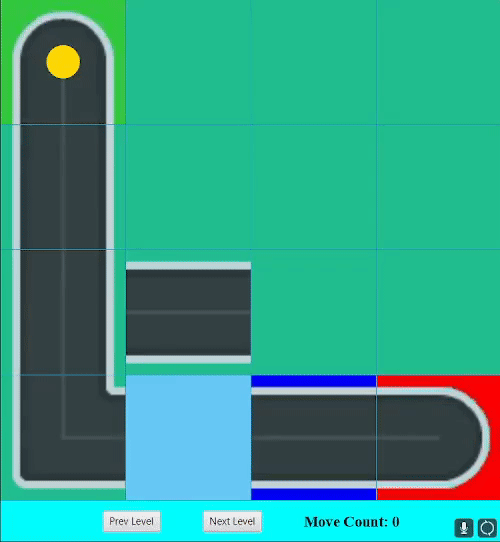
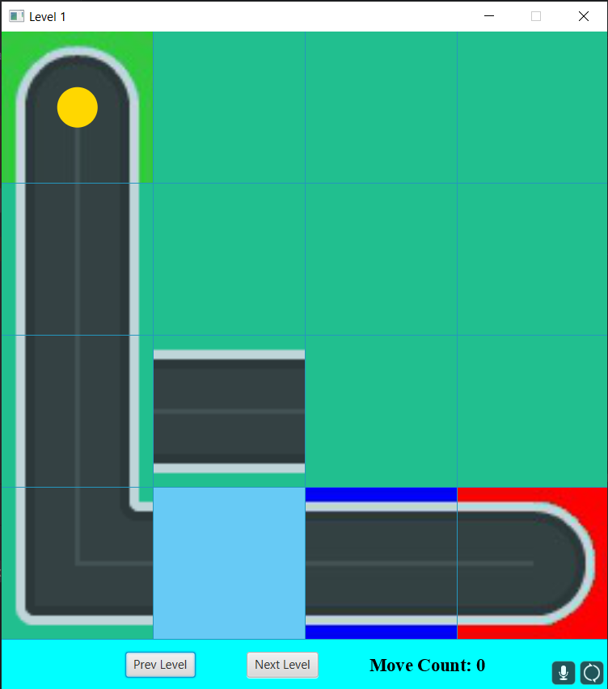
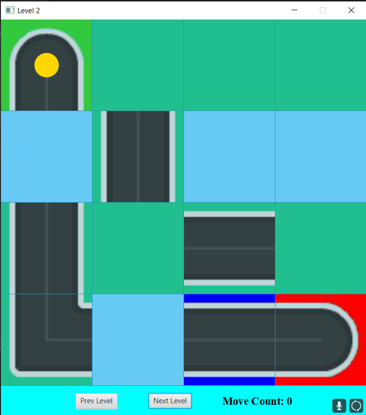
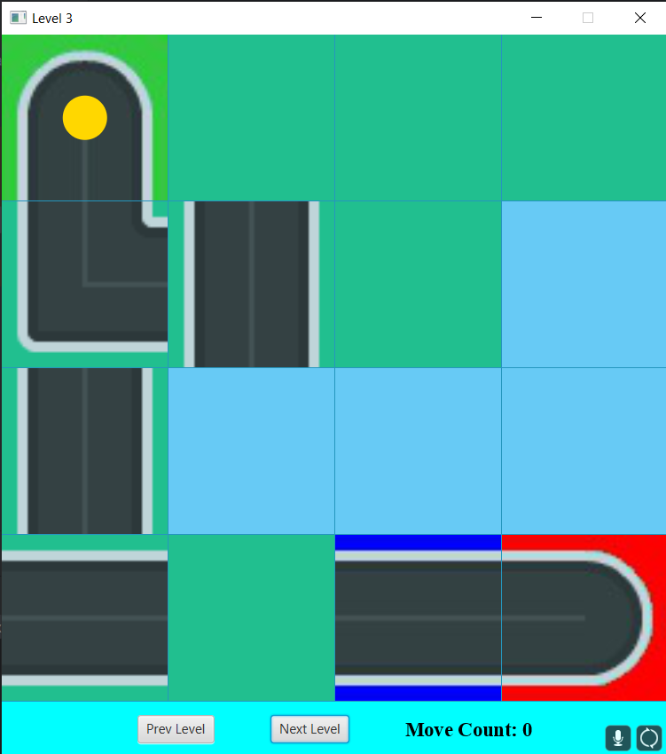
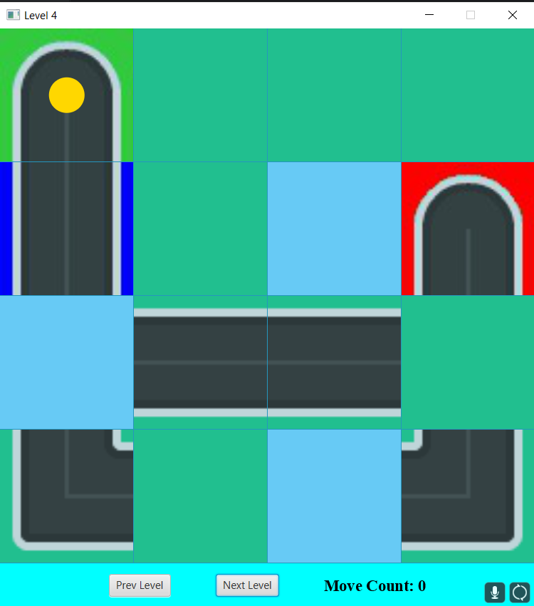
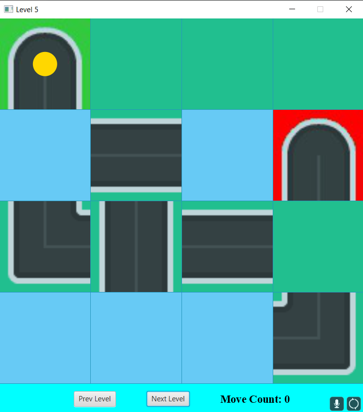

# Roll The Ball

  

## Description
Roll The Ball is a Java-based puzzle game where players need to navigate a ball through a maze to reach the goal. The game provides a challenging and engaging experience for users of all ages.

## Features
- Intuitive and interactive gameplay
- Multiple levels with increasing difficulty
- Smooth ball movement physics
- Obstacles and traps to make the gameplay more challenging
- High score tracking to encourage competition among players

## Technologies and Libraries Used
- Java
- JavaFX

## Levels

## Contributing
Contributions are welcome! If you have any ideas or improvements, please feel free to submit a pull request.
